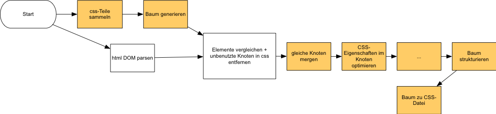
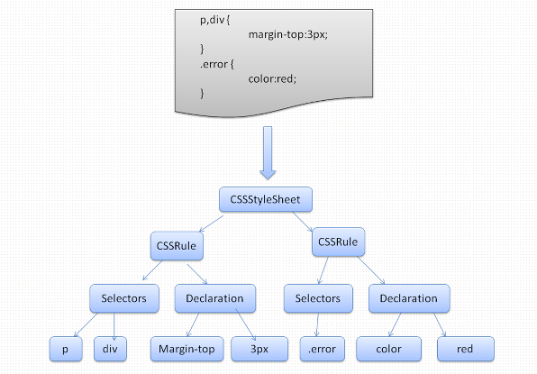

# Braindump zur Hausarbeit

## Titel:

Implementierung eines Source-To-Source-Kompilierers zur Optimierung von CSS-Dateien im Webstack

## Hintergrund / Motivation

Im Alltag eines Frontend-Entwicklers, eines Mitarbeiters an einem Web-Projekt oder des Entwicklers für das grafische User Interface kommt es nicht selten vor, dass die Beschreibung der grafischen Elemente durch Cascading Stylesheets geschieht. Noch seltener sind diese Style Angaben fehlerfrei. Sei es aufgrund von Zeitdruck, unterschiedlichen Entwicklern oder durch nachträgliches Bugfixing, oft sind CSS-Regeln inkonstistent aufgestellt, zum Beispieln existieren noch Regeln, die garnicht mehr im DOM der Seite zu finden sind. Es werden Regeln mehrmals überschrieben und es wird nicht auf Optimierung von Selektoren geachtet. 

Seit 2010 berücksichtigt der Page Ranking Algorithmus von Google auch die Ladezeiten für Websites. Seiten, die neben SEO ein gutes Page Ranking erhalten, werden demnach auch durch ihre Ladezeiten bestimmt. Die Ladezeiten spielen zwar im Vergleich mit SEO nur eine kleine Rolle, können aber zu einem besseren Ergebnis beitragen (Weite Informationen: http://googlewebmastercentral.blogspot.de/2010/04/using-site-speed-in-web-search-ranking.html).
Ladezeiten von mobilen Websites und Web-Anwendungen bzw. Seiten, die über mobile Internetverbindungen geladen werden, sollten schnell und nur wenig Daten übertragen, um ein konsistentes Benutzererlebnis zu gewährleisten. Statistiken zeigen, dass Benutzer auf Websites eher verbleiben wenn diese schnell geladen werden und der Benutzer schnell Informationen abrufen oder mit der Anwendung interagieren kann.

Im Rahmen der Hausarbeit für das Fach Compilerbau im Sommersemester 2013 im Master-Studiengang Informatik - Verteilte und Mobile Anwendungen an der Hochschule Osnabrück / University of Applied Sciences soll ein Werkzeug entwickelt werden mit dem sich Stylesheets optimieren lassen. Dazu soll ein Kommandozeilentool entwickelt werden, womit CSS-Optimierungen gesteuert und ausgegeben werden können. 

### Optmierungsregeln

in CSS-Dateien:

* entfernen nicht genutzter Knoten
* shorthand (Beispiel: margin-top: 50px; margin-left:50px; => margin: 50px 0 0 50px;)
* **Gruppierung ähnlicher Stile (mergen gleicher css selektoren)**
* **Linebreaks-Reduzierung**
* **Entfernung unnötiger Zeichen (zum Beispiel letztes Semikolon je Selektor)**
* **Farb-Shorthands (#fffff => #fff, #babab => #bab)**
* **Entfernen von "px" bei Wert 0 (padding: 0px; => padding: 0;)**
* Entfernen von unbenutzten Selektoren (Vgl. mit DOM)
* **Kompression**
* **Strukturierung**
* Automatisches Einfügen von Standard-Styles (gibt verschiedene NoWraps und Default-Wrapper)

1. Entfernen nicht genutzter Knoten
**2. Gruppierung / Mergen gleicher Knoten**
3. Einzelne Regeln

außerhalb von CSS-Dateien:

* CSS Platzierung (in html)
* **Zusammenführung zu einer Datei**
* **Minifizieren**
* Verschönerung

## Testdaten

* VM/Webserver mit großen Beispiel (zur Zeitmessung)
* im Vergleich werden identische Seite mit und ohne Optimierung getestet
* Zu testende Daten: Ausgabeergebnis (immernoch korrekt?), Ladezeiten, Übertragungsgrößen

## Workflow

Im Folgenden wird der Workflow skizziert sein:

##### html DOM parsen
HTML Dateien werden durchlaufen und CSS Dateien eingesammelt und zu einer Datei zusammengeführt. HTML-Parsing erzeugt keinen Baum. Anschließend wird mittels Flex und Bison ein Baum generiert.

##### Elemente vergleichen
Im dem generierten Baum werden Elemente des html und Elemente des CSS verglichen. CSS Elemente die nicht im HTML vorkommen, werden aus dem  Baum entfernt.

##### Gleiche Knoten mergen
Knoten mit gleicher Bezeichnung werden verglichen und, wenn gleiche Selektoren verwendet werden, werden diese durch das Element rechts (im Baum) überschrieben. Alle anderen Selektoren werden zusammengeführt. 

##### Selektoren optimieren
Der restliche Baum wird durchlaufen und jeder Knoten wird analysiert und nach den aufgestellten Optimierungsregeln bearbeitet. 

##### Baum strukturieren
Nach der Optimierung wird der Baum neu geordnet. 

##### Baum zu CSS
Der Baum wird als neue CSS-Datei geschrieben und in die HTML-Dateien eingebunden. Die gesamte Ausgabe wird in einen neuen Ordner ausgegeben.

### Arbeitspakete

* Testdaten / Webserver / VM
* Kommandozeilentool-Grundaufbau / CSS sammeln
* Baum generieren / Analyse 
* Entfernen nicht genutzter Knoten
* mergen gleicher Knoten
* CSS-Eigenschaften optimieren
* Baum strukturieren
* Baum -> CSS
* Doku / Hausarbeit

### Generierter Baum (Beispiel)

(Beispiel von html5rocks.com : How Browser work)

## Links

* http://www.queness.com/post/402/15-css-tips-and-tricks
* http://www.queness.com/post/588/15-ways-to-optimize-css-and-reduce-css-file-size
* http://www.w3.org/TR/css3-syntax/#grammar0
* http://googlewebmastercentral.blogspot.de/2010/04/using-site-speed-in-web-search-ranking.html
* http://www.html5rocks.com/de/tutorials/internals/howbrowserswork/
